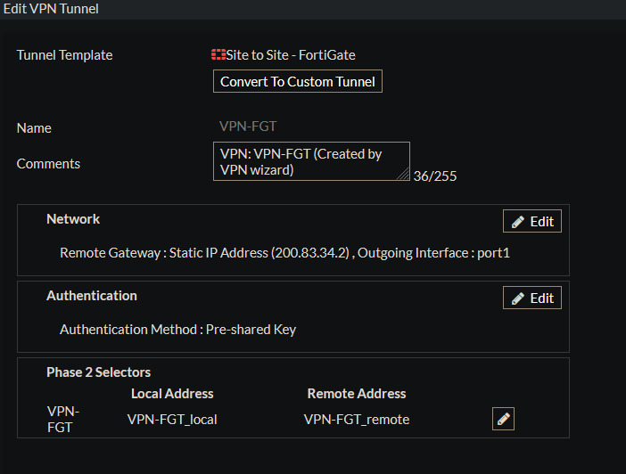
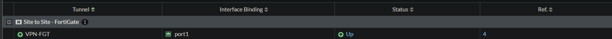
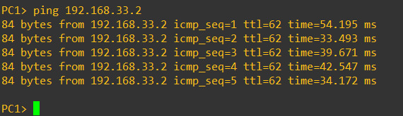
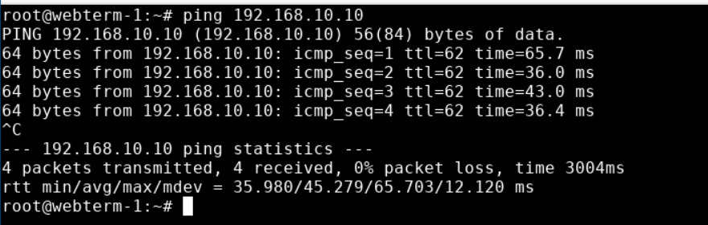
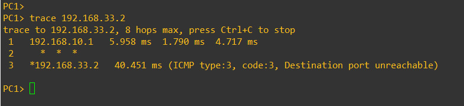

# Documentación del Laboratorio: VPN Site-to-Site FortiGate - Cisco

## 1. Datos del laboratorio


**Estudiante:** Albert Morel  

**Matrícula:** 2025-0833  

**Asignatura:**  Seguridad de Redes

**Laboratorio:** VPN Site-to-Site FortiGate - Cisco  

**Plataforma utilizada:** GNS3  

---

## 2. Propósito del laboratorio

El propósito de este laboratorio es implementar una comunicación segura entre una red de usuarios y un servidor web utilizando una VPN Site-to-Site.

La VPN fue configurada entre un firewall FortiGate y un router Cisco. La comunicación entre ambas redes se realiza a través de un enlace IPsec, permitiendo que el usuario pueda acceder al servidor que se encuentra en la red remota.

Además, se realizaron pruebas de conectividad para comprobar que el túnel VPN está funcionando y que el tráfico entre las redes puede ser transportado mediante IPsec.

---

## 3. Objetivos

Los objetivos principales de la práctica son:

- Comunicar el usuario con el servidor a través del enlace VPN.
- Comprobar que la comunicación solo fluye si el enlace VPN está activo.

---

## 4. Topología

La infraestructura utilizada está compuesta por:

- 1 FortiGate.
- 2 routers Cisco.
- 1 switch.
- 1 equipo de usuario.
- 1 servidor web.
- Un enlace que representa el ISP.

El router R1 funciona como parte de la infraestructura intermedia entre el FortiGate y R2.

### Diagrama de la topología


---

## 5. Direccionamiento IP

El direccionamiento utilizado en la práctica se organizó de la siguiente manera:

| Dispositivo | Interfaz | Dirección IP | Máscara |
|---|---|---|---|
| FortiGate | port1 | 200.83.33.2 | 255.255.255.252 |
| FortiGate | port2 | 192.168.10.1 | 255.255.255.128 |
| R2 | FastEthernet0/0 | 200.83.34.2 | 255.255.255.252 |
| R2 | FastEthernet1/0 | 192.168.33.1 | 255.255.255.240 |
| Web Server | eth0 | 192.168.33.2 | 255.255.255.240 |

La red de usuarios utiliza una máscara `/25`, mientras que la red del servidor utiliza una máscara `/28`.

---

## 6. Redes utilizadas en la VPN

La comunicación protegida por la VPN se estableció entre:

**Red de usuarios:**

`192.168.10.0/25`

**Red del servidor:**

`192.168.33.0/28`

En R2 se utilizó una ACL para identificar el tráfico que debe ser protegido por IPsec:

```text
192.168.33.0/28 → 192.168.10.0/25


---

## 7. Configuración de la infraestructura

La infraestructura fue implementada en GNS3 utilizando un FortiGate, dos routers Cisco, switches, un equipo de usuario y un servidor ubicado en una red remota.

El FortiGate utiliza la interfaz `port2` para la red de usuarios `192.168.10.0/25` y la interfaz `port1` para la conexión hacia la red externa.

El router R1 funciona como equipo intermedio entre el FortiGate y R2. R1 utiliza las redes `200.83.33.0/30` y `200.83.34.0/30`.

R2 proporciona conectividad hacia la red del servidor `192.168.33.0/28`.

---

## 8. Configuración de la VPN Site-to-Site

Se implementó una VPN Site-to-Site utilizando IPsec entre el FortiGate y el router Cisco R2.

Los extremos utilizados fueron:

- FortiGate: `200.83.33.2`
- R2: `200.83.34.2`

La VPN permite transportar tráfico entre:

- Red de usuarios: `192.168.10.0/25`
- Red del servidor: `192.168.33.0/28`

En R2 se configuró ISAKMP, autenticación mediante clave precompartida, grupo Diffie-Hellman 5, transform-set, PFS y crypto map.

En el FortiGate se configuraron las fases correspondientes de IPsec, las redes local y remota, la ruta hacia la red remota y las políticas necesarias para permitir el tráfico por el túnel.

### Evidencia de configuración de la VPN



### Estado de la VPN



---

## 9. Pruebas de conectividad

Para comprobar el funcionamiento de la infraestructura se realizaron pruebas de conectividad entre el equipo de usuario y el servidor.

### PC1 hacia el Web Server

Se realizó un ping desde PC1 hacia la dirección `192.168.33.2`.



La prueba permitió comprobar que existe comunicación entre la red de usuarios y la red del servidor.

### Web Server hacia PC1

También se realizó una prueba en sentido contrario desde el servidor hacia `192.168.10.10`.



La prueba obtuvo respuestas desde el equipo de usuario.

### Traceroute

Se realizó un `trace` desde PC1 hacia `192.168.33.2` para observar el recorrido del tráfico.



---

## 10. Verificación de IPsec

Además de las pruebas de conectividad, se verificó el estado de las asociaciones de seguridad IPsec en R2.

La salida de `show crypto ipsec sa` mostró tráfico encapsulado, cifrado, desencapsulado y descifrado.

Entre los valores observados se encontraron:

```text
#pkts encaps: 9
#pkts encrypt: 9
#pkts decaps: 9
#pkts decrypt: 9
